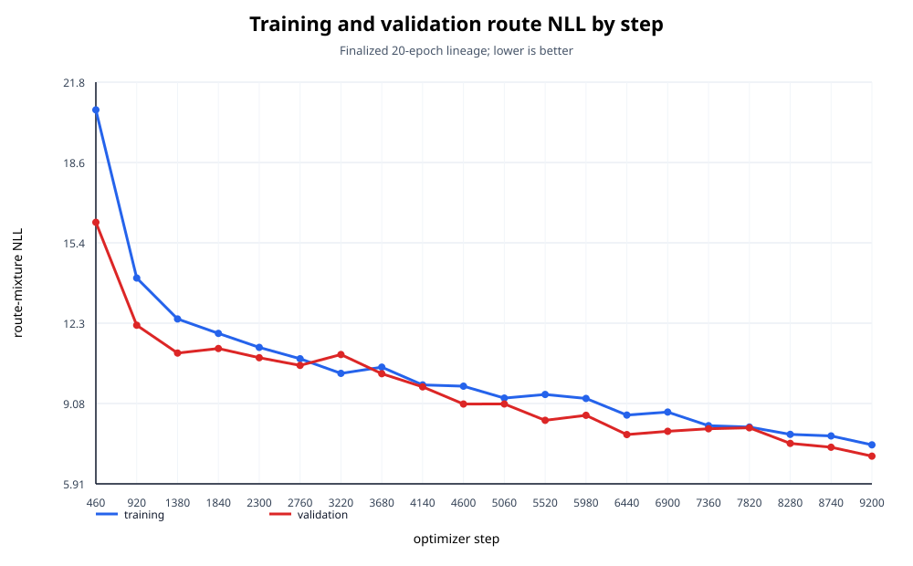
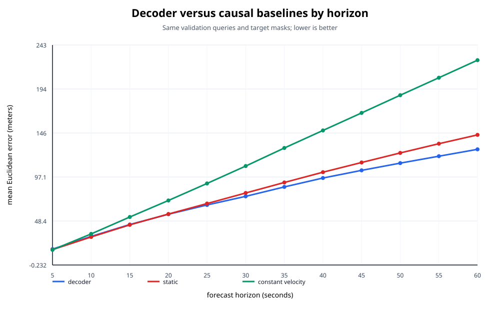
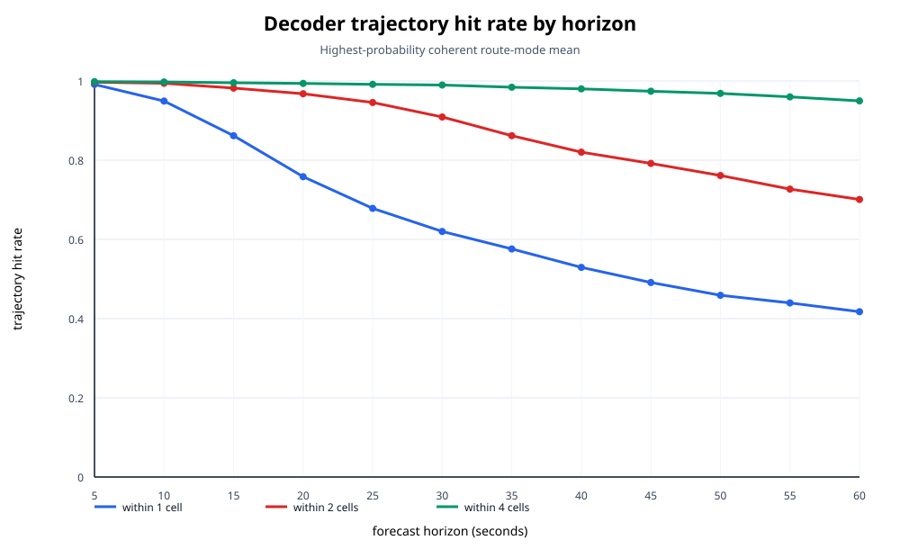
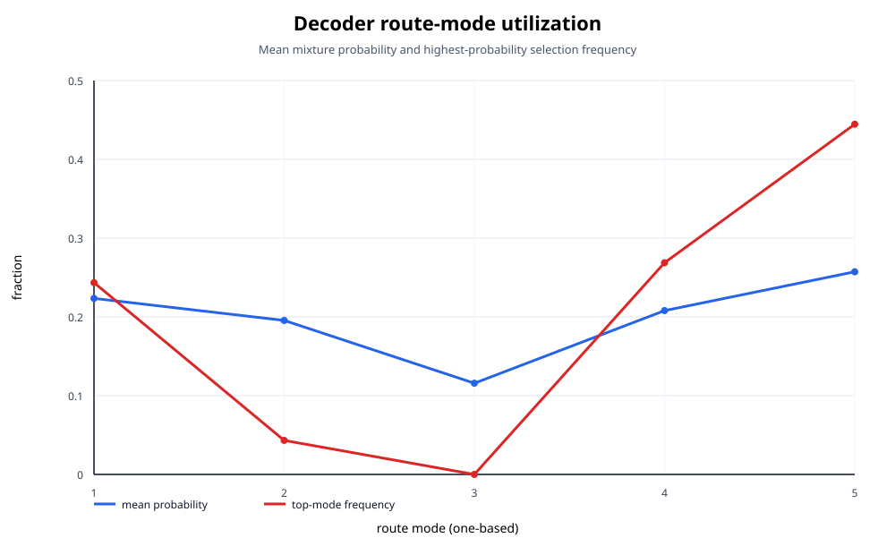

# Completed decoder evaluation

Status: **passed** on the locked 115-session decoder-validation partition. This is development validation, not a held-out decoder test.

## Answers

1. **Does the decoder outperform static position?** Yes. The highest-probability route-mode mean has ADE 75.128 m versus 80.124 m, 60-second FDE 127.725 m versus 143.711 m, and last-valid FDE 121.330 m versus 136.233 m. All three paired session-bootstrap 95% intervals support lower decoder error = **True**.

2. **Does it outperform constant velocity?** Yes. Constant velocity has ADE 114.990 m, 60-second FDE 226.330 m, and last-valid FDE 215.652 m; all three paired intervals support lower decoder error = **True**. Constant velocity fell back to static for 24 of 3680 queries.

3. **At which horizons are gains largest?** The largest central gain over static is at 60 seconds (15.986 m lower mean error). The largest central gain over constant velocity is at 60 seconds (98.605 m lower).

4. **What are the primary metrics?** Route-mixture NLL is 7.004335993 (session-bootstrap 95% CI [5.904692, 8.164754]). ADE is 75.128 m (95% CI [72.305, 78.129]); 60-second FDE is 127.725 m (95% CI [123.052, 132.729]); last-valid-horizon FDE is 121.330 m (95% CI [116.856, 126.066]). Oracle diagnostics are minADE@5 = 47.395 m and minFDE@5 = 71.052 m; neither was used for selection or superiority claims.

| Exact horizon | Hit within 1 cell | Hit within 2 cells | Hit within 4 cells |
| ---: | ---: | ---: | ---: |
| 15 | 0.8618 | 0.9821 | 0.9956 |
| 30 | 0.6200 | 0.9091 | 0.9898 |
| 45 | 0.4911 | 0.7919 | 0.9742 |
| 60 | 0.4174 | 0.7008 | 0.9498 |

These are trajectory hit rates, not classification accuracy.

5. **Was validation performance still improving at step 9,200?** Yes. Epoch 20/step 9,200 was the lowest validation NLL of all 20 epochs and improved over epoch 19 by 0.351008 (4.772%). Across reported epochs 16-20 it improved by 1.080311, although that five-result segment was not monotonic. This does not authorize extending the completed run.

6. **What can be concluded about dataset scale?** The original decoder corpus was 86/11/10 train/validation/test sessions (107 total); the current split is 920/115/115 (1,150 total). The earlier decoder shares the architecture, target contract, masks, coordinate units, horizons, and route-NLL reduction family, but encoder policy, populations/data vintage, compute, and schedule also changed. Therefore the causal effect of dataset scale **cannot be identified from completed runs alone**. No subset model was launched and the incomplete 725/920 training census was not resumed. Existing census artifacts cover 725 sessions, 4,202,880 eligible routes, and 48,351,408 valid targets; no estimate was extrapolated to the missing 195 sessions. The historical encoder value 17.4651 is not compared numerically with decoder NLL because the objectives differ.

## Reproduction and access audit

- The selected read-only `best.pt` at step 9,200 reproduced NLL 7.004335993; expected 7.004335993, difference 0, tolerance 2e-6.
- Counts reproduce exactly: 3680 valid queries and 42265 valid targets. Target-mask diagnostics: missing 0, eliminated 1290, phase-9 terminal 605, out-of-envelope 0, nonfinite 0.
- Dataset access was exactly 230 validation requests, 115 validation open attempts, and 115 validation opens. Training, original test, and future-test requests/opens were all zero.
- The model ran with `eval()`, `torch.inference_mode()`, CUDA BF16 autocast, deterministic ordering, no shuffle, and no augmentation.
- No optimizer or scheduler was constructed by the final-checkpoint evaluation path; no backward pass, parameter update, checkpoint mutation, training resume, scale run, or census continuation occurred. PID 42044 was not touched.
- A frozen helper bug affected only `minADE@5`: NumPy advanced indexing swapped the mode/horizon interpretation. The reporting-layer correction gives 47.395 m and matches the finalized epoch-20 diagnostic; contract-bound evaluator and metrics sources were not changed.

## Charts and data

Underlying CSV data are in `tables/`. Machine-readable metrics, bootstrap intervals, execution/access evidence, optimization history, historical comparability, and file hashes are adjacent to this report.

## Claim boundary

These results do not establish held-out decoder generalization, optimal rotation quality, or production readiness. The original encoder-test sessions and all future decoder-test sessions remain untouched.
